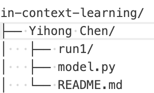

# In-Context Learning Research Repository

This repository hosts our group research project on in-context learning and related modeling approaches. It is collaboratively maintained by the group members for experimentation, analysis, and paper writing.

---

## 📁 Project Structure
```
IN-CONTEXT-LEARNING/
│
├── garg/                  # (Example) Experimental results by member Garg
├── models/                # Shared or baseline model components
├── src/                   # Source code for utilities, training, evaluation, etc.
├── nanoGPT/               # NanoGPT-related experiments (if used)
│
├── investigation/         # Paper reviews, notes, function classes, etc.
│   ├── 2208.01066v3.pdf
│   ├── 2310.10616v1.pdf
│   └── function_class.md
│
├── project proposal/      # LaTeX files for the project writeup
│   ├── main.tex / .pdf
│   ├── paper.tex
│   └── refs.bib
│
├── setting.jpg            # Image(s) describing experiment or system setting
├── environment.yml        # Conda environment definition
├── LICENSE
├── Final Project Topics Spring 2025.pdf
├── .gitignore
└── README.md              # You’re here!
```
---

## ⚙️ Getting Started

1. **Clone the repository**
   ```bash
   git clone https://github.com/your-repo-url/in-context-learning.git
   cd in-context-learning


2. **Adding Your Experiments**

Each member should create a personal directory at the root level of the repository:  `mkdir your_name`


Inside your directory, you can organize:
- code
- checkpoints
- logs
- readme / notes
- visualizations

Example:



## 🧠 Git Commands for Beginners

### Check current status
`git status`

### Stage specific file
`git add yourfile.py`

### Commit your changes
`git commit -m "Add new experiment in alice/run1"`

### Pull latest changes from remote (important before pushing!)
`git pull origin main`

### Push your commits to the remote repository
`git push origin main`

### Create and switch to a new branch (if needed)
`git checkout -b branch-name`

### Switch back to main branch
`git checkout main`

> 💡 Always pull (git pull origin main) before pushing your changes to avoid conflicts.


---


## 📄 License

This project is licensed under the MIT License.


## ✍️ Contributors
	•	Binwen Liu
	•	Quan Yuan
	•	Peiyu Xu
	•	Yihong Chen

    
## 📌 Acknowledgements
	•	NanoGPT
	•	ArXiv papers and investigations included in /investigation

